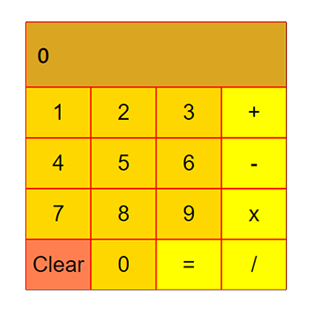

# React Calculator

This is project is a part of my **React Marathon**. I am doing 6 react projects using some instructions given [this blog](https://daveceddia.com/react-practice-projects/). This blog has given out 6 React Projects ideas to fallow and improve skills.

This is the first React App I selected from those six.

## This is a basic calculator made with just React no Redux

### Features of this App

- This App manages only one state and that is the display: the output displayed on top of the calculator
- User can use device keyboard to type numbers, operational characters and the display need not be focused
- User can type _x_ instead of _\*_ for multiplication
- Pressing _backspace_ will erase the latest character
- Pressing _enter_ will solve the input

I think this is kind of a React App with a minimal state management. This app has only one state and that is the display of the calculator: the part which shows the output.

The App listens to document level KeyDown events and change the state if a valid key is pressed.

_Backspace_ is also supported but it is not added to UI.

Clicking _=_ button is equal to pressing keyboard _Enter_ buttton

I prefer adding styles in `scss` files. So I have added one to this project. All the styles are in `index.scss` file.
